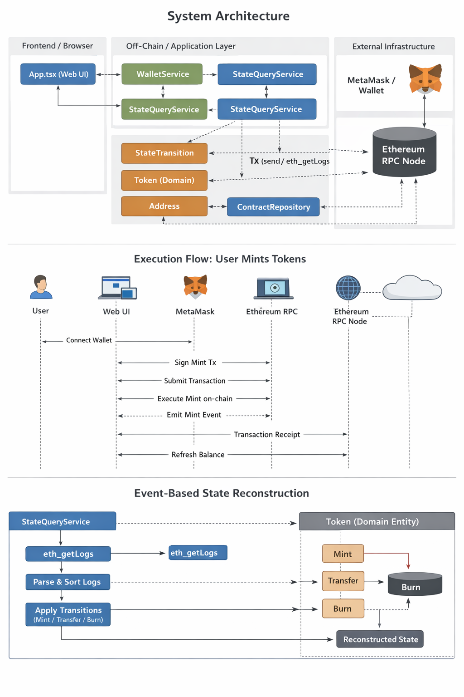

# Ethereum Account State

[](https://github.com/egpivo/ethereum-account-state/actions/workflows/ci.yml)

Minimal token + wallet UI built around a deterministic, inspectable state machine.



## Quickstart

### Local (Anvil)

```bash
npm install
anvil
```

```bash
npm run deploy:local
cd frontend && npm install && npm run dev
```

- MetaMask: `http://localhost:8545` (chainId `31337`)

### Sepolia

```bash
cp .env.example .env
# set PRIVATE_KEY=...
npm run deploy:sepolia
cd frontend && npm install && npm run dev
```

### Caveat: GitHub Pages + local Anvil

When you open the frontend from GitHub Pages (origin `https://egpivo.github.io`) but connect MetaMask to a local Anvil node:

- **MetaMask / Blockaid may flag transactions as “deceptive” or the contract address as “malicious”**, because the site is a public GitHub Pages domain talking to a non-public RPC (`http://127.0.0.1:8545`) and a local demo contract address (for example `0xe7f1725e7734ce288f8367e1bb143e90bb3f0512` on Anvil).
- The underlying flow is still: **browser → MetaMask → whichever network MetaMask is on (Anvil, Sepolia, Mainnet, etc.)**. GitHub Pages does not bypass MetaMask.

If you deliberately use GitHub Pages with Anvil for local testing, you may need to:

- Explicitly review / accept MetaMask security alerts for this site and contract address, or
- Temporarily relax Blockaid / scam protection in MetaMask (and re‑enable it afterwards),
- Or, for everyday local development, prefer running the frontend on `http://localhost:5173` (or similar) via `npm run dev`, which typically triggers fewer security warnings.

## Commands

```bash
npm run build
npm test
npm run lint
```

## Docs

- [docs/getting-started.md](docs/getting-started.md)
- [docs/state-machine.md](docs/state-machine.md)
- [docs/execution-flow.md](docs/execution-flow.md)
- [docs/authorization-model.md](docs/authorization-model.md)
- [docs/deployment.md](docs/deployment.md)
- [docs/advanced-features.md](docs/advanced-features.md)
